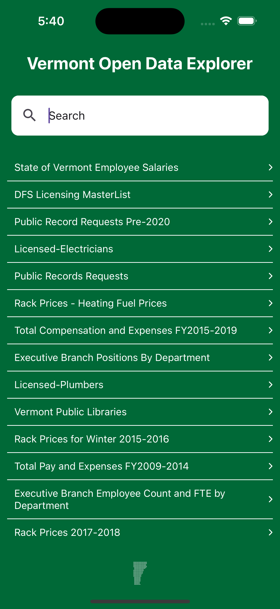

# Vermont Open Data Explorer

## Overview
This is a simple web application that allows users to explore and visualize open data from the state of Vermont.

This project was meant to test React Native. It was built using the [Expo](https://expo.io/) framework.

